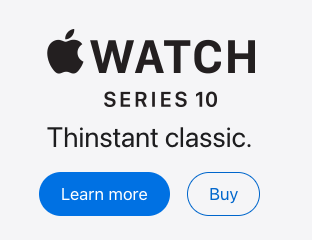

# Button Component Prompts

## Prompt 1
Create a rounded blue button with a scaling hover animation that follows the component structure from the @components directory.

Display this button alone on the @page.tsx page.

## Prompt 2
Please write clean code for this button component and provide two different options as shown in the image below.

